# KINETIK - Luxury Digital Automotive Showroom 

---

## Student Information

| Item | Details |
|--------|---------|
| Student Name | Malaz Mohammed Ibrahim |
| Registration Number | 24579/2024 |
| Course | EWA408510 – E-Commerce and Web Application |
| Project Title | KINETIK - Online Car Dealership Management System |
| Academic Year | 2025-2026 |

---

# Table of Contents

| No | Section |
|----|---------|
| 1 | Introduction |
| 2 | Problem Statement |
| 3 | Objectives |
| 4 | System Features |
| 5 | Technologies Used |
| 6 | System Architecture |
| 7 | Screenshots |
| 8 | GitHub Repository Link |
| 9 | Deployment Link |
| 10 | CI/CD Description |
| 11 | Challenges Encountered |
| 12 | Future Work |
| 13 | Conclusion |

---

# 1. Introduction
KINETIK is a specialized high-performance web-based car dealership and staging application designed for exotic sports car collectors and enthusiasts in Kigali, Rwanda. The system bridges the gap between premium global automotive listings and local buyers by providing, dynamic specifications, and custom persistent customer garages.
KINETIK is designed to simplify vehicle inventory management and improve the customer experience. The system enables administrators to manage vehicles, brands, and categories while allowing customers to browse available vehicles online through a responsive and user-friendly interface.
The project was developed using PHP, MySQL, HTML, CSS, JavaScript, Docker, and GitHub. It demonstrates practical application of web development, database management, deployment, and DevOps concepts.

---

# 2. Problem Statement
In Rwanda, there is currently no dedicated online platform focused on managing and selling vehicles through a complete e-commerce system. Most car dealerships rely on social media platforms, messaging applications, spreadsheets, or manual records to advertise and manage their inventory.
These methods make it difficult to keep vehicle information organized and up to date. Customers often have to contact sellers directly to confirm availability, pricing, and vehicle specifications. As a result, finding accurate information can be time-consuming and inconvenient for both customers and dealerships.
In addition, dealerships face challenges in tracking available vehicles, managing inventory efficiently, and presenting their vehicles in a professional and centralized manner online.
Therefore, there is a need for a web-based car dealership management system that allows dealerships to manage vehicle listings digitally while providing customers with easy access to vehicle information, pricing, and availability through a single online platform.

---

# 3. Objectives
### General Objective:
To develop a web-based luxury and sports car dealership platform in Rwanda that allows customers to browse available vehicles, view detailed car information, and purchase vehicles online.
### Specific Objectives
### Specific Objectives
* To provide an online platform where customers can browse luxury and sports cars available in Rwanda.
* To display detailed vehicle information, including specifications, pricing, and images.
* To organize vehicles by brands and categories for easier navigation.
* To provide secure administrator access for managing vehicle listings.
* To improve the customer experience when searching for and exploring vehicles online.
* To allow administrators to add, update, and remove vehicle listings efficiently.
* To deploy the application online so it can be accessed from anywhere.
* To use Docker and GitHub to support development, deployment, and maintenance of the system.

---

# 4. System Features

| Feature | Description |
|----------|------------|
| Administrator Authentication | Secure login system that allows only authorized administrators to manage the dealership platform. |
| Vehicle Management | Administrators can add, update, and remove luxury and sports car listings. |
| Brand Management | Vehicles can be organized and managed according to their brands. |
| Category Management | Vehicles can be grouped into categories such as Sports Cars, Supercars, SUVs, and Luxury Sedans. |
| Vehicle Catalog | Customers can browse all available vehicles in the dealership. |
| Vehicle Details Page | Customers can view detailed information including price, specifications, images, and descriptions. |
| Search and Navigation | Customers can easily find vehicles by browsing categories and brands. |
| Checkout Request System | Customers can submit their details and purchase requests for selected vehicles. |
| Order Management | Purchase requests are stored and managed through the system database. |
| Responsive Design | The platform is optimized for desktop, tablet, and mobile devices. |
| Docker Integration | The application is containerized using Docker for consistent deployment across different environments. |
| Online Deployment | The system is deployed online, allowing customers to access the dealership from anywhere. |
---

# 5. Technologies Used
| Category | Technology |
|-----------|------------|
| Frontend | HTML5, CSS3 (Custom Dark Theme Gradients & Glassmorphism Framework) |
| Backend | PHP (Hypertext Preprocessor with object-oriented session tracking parameters) |
| Database | MySQL Server Database Engine running structured indexing using phpmmyadmin |
| Persistence Layer | PDO (PHP Data Objects) utilizing bound parameters for secure SQL interaction |
| Version Control | Git, GitHub |
| Containerization | Docker Engine with specialized environment containers |
| Cloud Infrastructure | infintyfree |

---
# 6. System Architecture

```text
                    Customer / Administrator
                              ↓
                         Web Browser
                              ↓
          Frontend (HTML, CSS, JavaScript)
                              ↓
                     PHP Application
                              ↓
                       MySQL Database
```

### Architecture Description

The KINETIK system follows a three-tier architecture consisting of the presentation layer, application layer, and data layer.

#### Presentation Layer

The presentation layer is developed using HTML, CSS, and JavaScript. It provides the user interface through which customers can browse luxury and sports cars and administrators can manage vehicle listings.

#### Application Layer

The application layer is developed using PHP. It handles business logic, user authentication, vehicle management, order processing, and communication between the frontend and the database.

#### Data Layer

The data layer uses MySQL to store and manage application data. This includes vehicle information, brands, categories, administrator accounts, customer orders, and checkout details.

#### Deployment Architecture

```text
Developer
    ↓
GitHub Repository
    ↓
Docker Container
    ↓
Online Server
    ↓
Users Access KINETIK
```
### Architecture Description

The frontend handles user interactions and displays content. PHP processes business logic and communicates with the MySQL database, which stores application data such as vehicles, brands, categories, and administrator accounts.

---

# 7. Screenshots

## Home Page

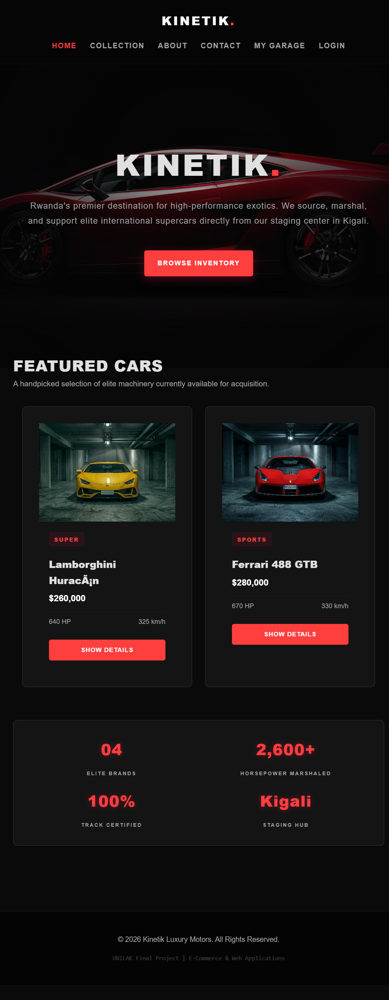

*Description: Landing page displaying featured vehicles .*

---

## Collection Page

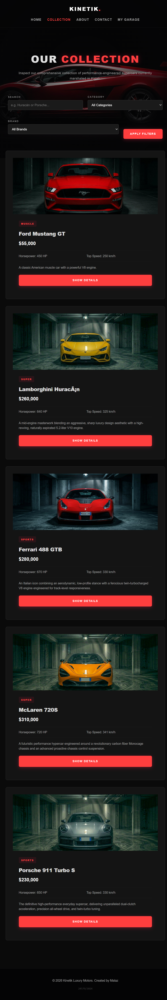

*Description: Displays all available vehicles.*

---

## Vehicle Details Page

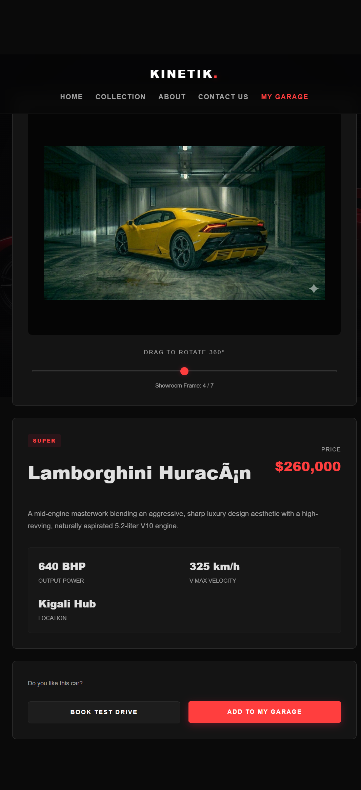

*Description: Shows detailed information about a selected vehicle with 360 view of the car.*

---

## cart page:

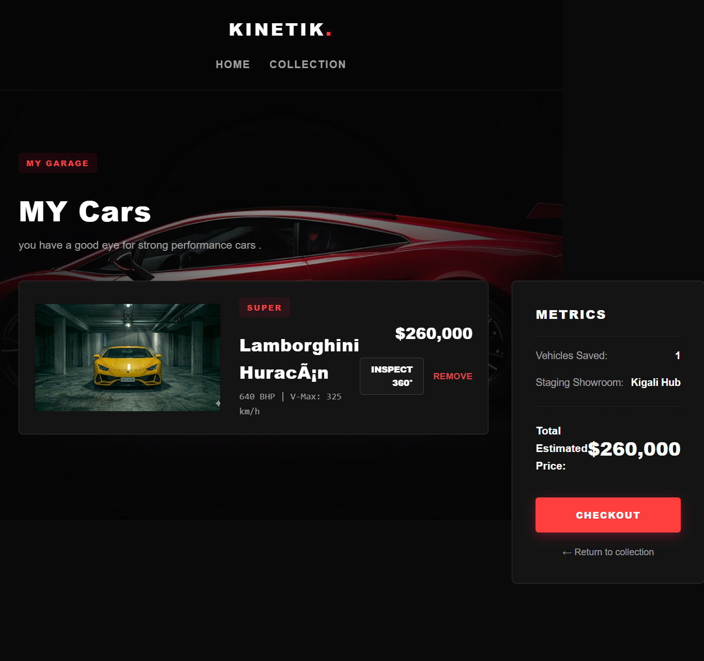

*Description: Shows detailed information about a selected vehicle.*

---

## Admin Dashboard

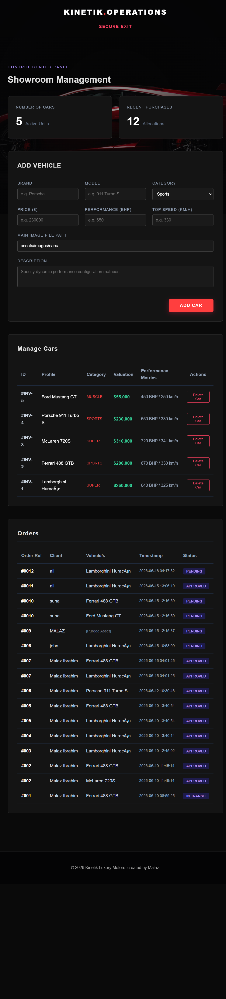

*Description: Administration interface for managing inventory.*

---

## contact us 

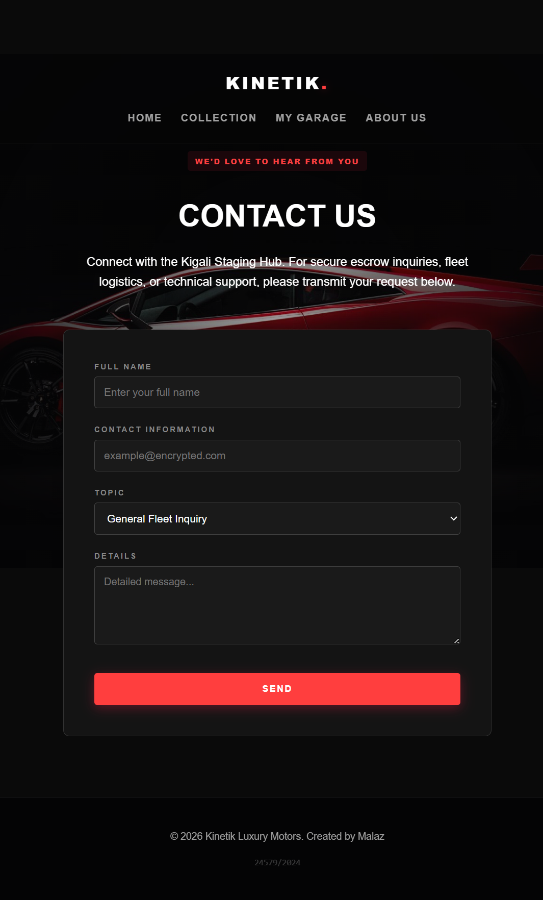

*Description: contact form with topic specification.*

---
## about us 

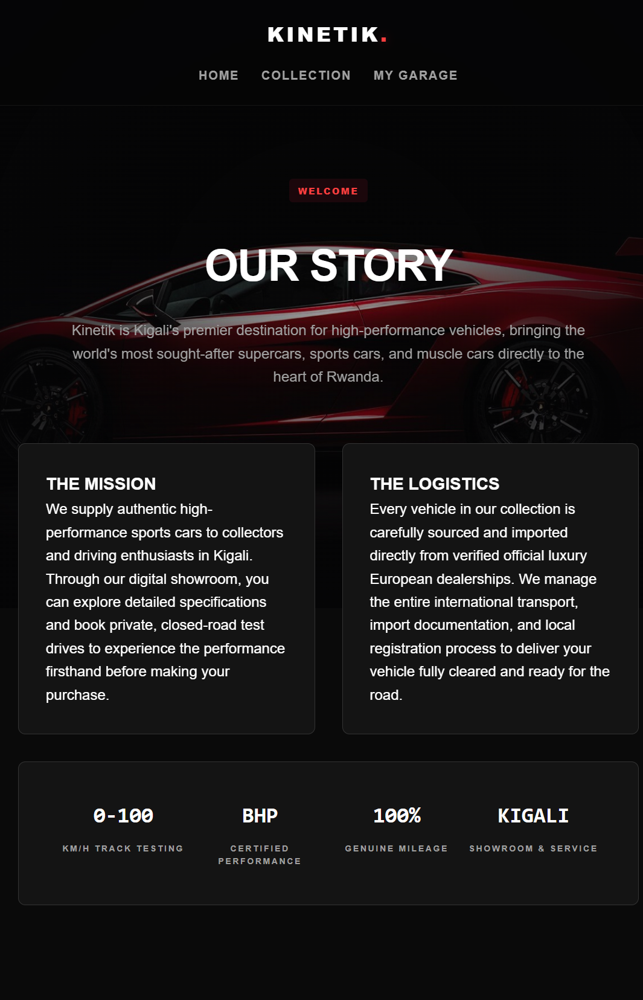

*Description: our mission , story and moto.*

---
## checkout

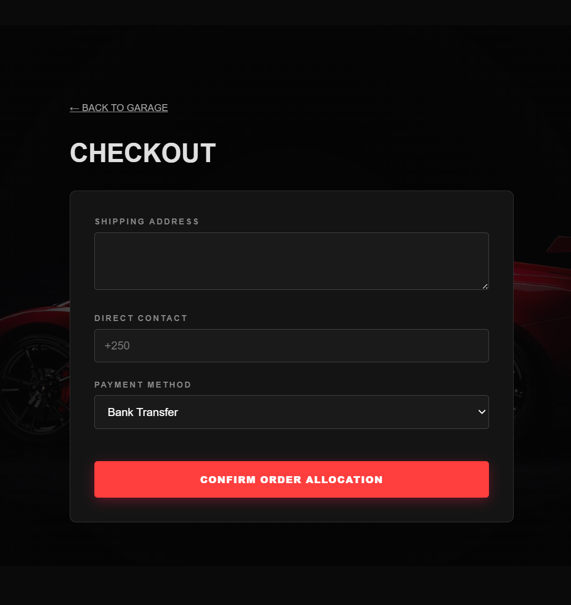

*Description: choose payment option and confirm payment*

---

# 8. GitHub Repository Link

https://github.com/malazmohdibrahim/Kinetik

---

# 9. Deployment Link

### Live Application

https://kinetik.freedev.app/src/index.php
### alternative
https://kinetik.onrender.com/garage.php


---

# 10. CI/CD Description

The project uses GitHub for version control and automated deployment.

### Workflow

```text
Developer Repository Push
            ↓
  GitHub Webhook Activation
            ↓
 Automated Cloud Build Routine
            ↓
 Environment Image Compilation
            ↓
   Health Verification Checks
            ↓
Container Hot-Swap Live Switch
```

Whenever code is pushed to GitHub, infinityfree automatically rebuilds and deploys the latest version of the application.

---

# 11. Challenges Encountered

- Docker installation took over 3 hours 
- Database connectivity issues : containers kept getting deleted every time docker restarted .
- huge CI conflicts caused by docker database container had to delete everything and start fresh
  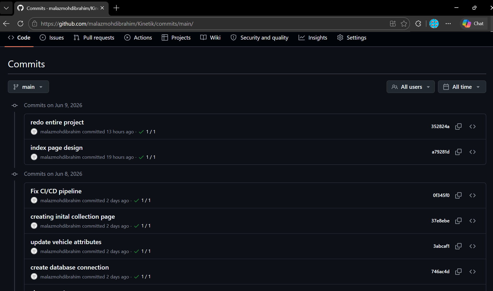
   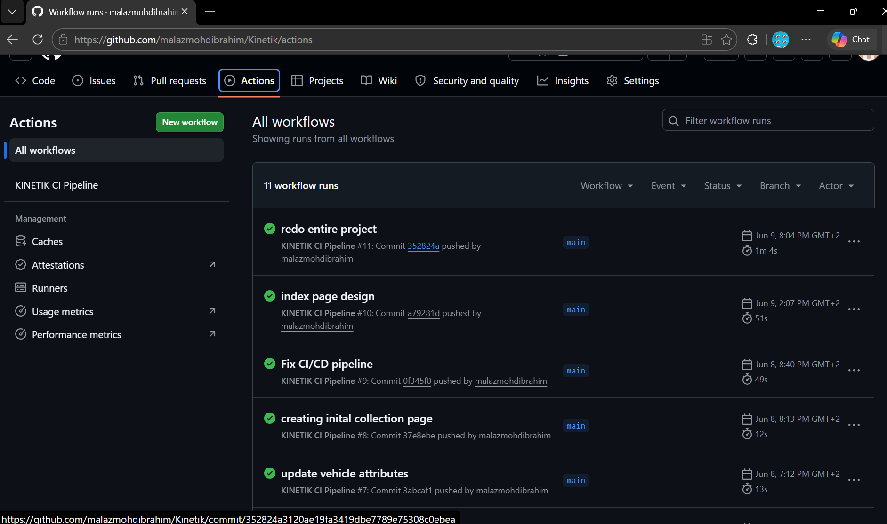
   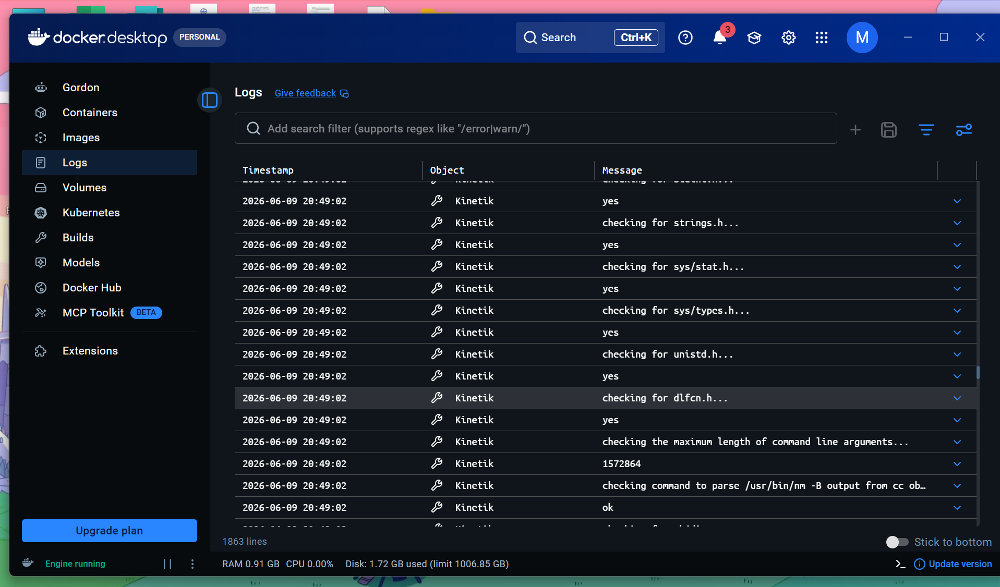
- Image upload on database .
- the 360 view feature.
- no deployment platfrom supports containerization (ie. docker).
- render required chnging the database from mySQL to PostGres.
- railway keeps crashing after deployment no reasons provided
- infinity free requires manual upload of everything so it wasnt time efficient but the only working option.
- at one point a collegue of mine (registeration number 24363/2024) had to step in and help with deployment he created a completely new repository on another laptop and imported all the codes and dockerfiles and used postgres instead of mysql to be compatiable with render this is the alternative deployment link : https://kinetik.onrender.com/index.php

---

# 12. Future Work

Future enhancements include:
- Interactive 360° Vector Rendering Modality: Introduce vector manipulation layers to enable driving clients to inspect multi-angle vehicle panels interactively.
- Real-time Escrow Payment Callbacks: Integrate automated financial webhooks to watch payment verification states in real time.
- Logistics Transport Tracking API: Deploy delivery progression interfaces showing asset routing states directly from the staging hub to localized physical delivery coordinates in Kigali.
- Automated Performance Maintenance Records: Implement automated diagnostic tracking models to help clients coordinate mechanical upkeep schedules from their private garages.

---

# 13. Conclusion

KINETIK successfully provides a modern online platform for a luxury and sports car dealership in Rwanda. The system allows customers to browse available vehicles, view detailed specifications, and submit purchase requests through an easy-to-use interface.
The project demonstrates the practical use of web development technologies including HTML, CSS, JavaScript, PHP, MySQL, Docker, and GitHub. It also shows how e-commerce concepts can be applied to the automotive industry by making vehicle information more accessible to customers online.
Through the development of KINETIK, a centralized and professional platform was created to support the promotion and sale of luxury and sports cars in Rwanda. The system improves the customer experience while providing an efficient way for administrators to manage vehicle listings and dealership information.
Overall, KINETIK serves as a strong foundation for a modern automotive e-commerce platform and can be further expanded with additional features in future versions.
